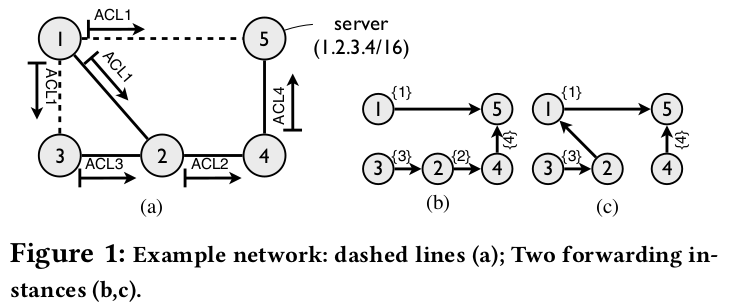

# CIDR2022 experiment instrcutions

## python dependencies

```
pip install -r requirements.txt
```

## Database configuration

Create a python file named `databaseconfig.py` to configuare the database connection. Put this file under `CIDR` folder.

```python
postgres = {
    "host": "127.0.0.1",
    "user": "username",
    "password": "password",
    "db": "c_table_database"
}
concrete_postgres = {
    "host": "127.0.0.1",
    "user": "username",
    "password": "password",
    "db": "concrete_table_database"
}
```

## Generate forwarding table with backup

`gen_forward_table_with_backup.py`: it is used to generate the forwarding table with backup links using **conditional tables**. It can set the percentage of the nodes who have backup links and who have filter. See the comments on each function for more details.

`gen_connected_graph.py` is used to generate the forwarding snapshot of topology storing into regular table. It can set the number of forwarding snapshots should be generated.

### Toy example 
To explain, the solid links represent the primary forward links. The dashed links represent backup links when primary link (1,2) fails. The links in the network are bi-directional but the ACLs are directional. For example, A traffic passes through node 1 to node 2, it would be filtered by ACL1 but it would not if it passes through node 2 to node 1.



**Generate forwarding table(conditional table) for toy example on Figure 1(a) in the submission**. The following code shows the example how `gen_forward_table_with_backup.py` works. The output forwarding tables may have different backup links and filters(ACL).


```python
# file stores edges for topology
file_dir = "/topo/"
filename = "toy_edges.txt"

# tablename in db for storing original toy topo 
as_tablename = "toy_as"

# load links in topology to database
load_topo(file_dir+filename, as_tablename)

# calculate the largest component of topology graph (here is the whole topology)
cursor.execute("select * from {}".format(as_tablename))
all_links = cursor.fetchall()
print("all links:", len(all_links))
connected_links, connected_nodes = get_largest_connected_network(all_links)
print("largest component: edges:", len(connected_links), "nodes:", len(connected_nodes))

# Store the largest component into db and use it as the experimental topology
topo_tablename = "topo_toy"
fwd_tablename = "fwd_toy"
cursor.execute("drop table if exists {}".format(topo_tablename))
cursor.execute("create table {}(n1 integer, n2 integer)".format(topo_tablename))
cursor.executemany("insert into {} values(%s, %s)".format(topo_tablename), connected_links)
conn.commit()

# calculate the spanning tree, return tree links and its root
spanning_links, root = gen_spanning_tree(connected_links)
print("root", root)
print("spanning tree links:", len(spanning_links))

# load spanning tree into db (without backup and filters)
load_tree_in_f(spanning_links, fwd_tablename)

# add backup links to spanning tree
add_link(root, topo_tablename, fwd_tablename, 0.6)

# add filter to spanning tree
add_filter(connected_nodes, root, 0.5, fwd_tablename)

# final fwd_tablename table stores the forwarding table with backup links and filters based on the toy topology
```

**Generate forwarding table(concrete table) for toy example like Figure 1(b)(c) in the submission**

```python
toy_example = [
    (1, 2),
    (1, 3),
    (1, 5),
    (2, 1),
    (2, 3),
    (2, 4),
    (3, 1),
    (3, 2),
    (4, 2),
    (4, 5),
    (5, 1),
    (5, 4)
]
# set the number of snapshot shoule be generated
num = 5

# transform
edges = tuple_to_nxdict(toy_example)

graph = nx.Graph(edges)

graph_yamada = Yamada(graph, num)   
trees = graph_yamada.spanning_trees()

# get nodes 
nodes = list(trees[0].nodes())

# the database used the concrete table
db_name = 'test'

# load in f table
print("Load tree in fc")
load_tree_in_f(db_name, trees, 5)
print("Done!")

print("add filters")
add_filter(db_name, nodes, num)
print("Done!")
```

## Generate routing table

The idea of generate routing table

```datalog
R(n1, n2, a) :- F(n1, n2, a).
R(n1, n2, a) :- F(n1 ,n3 ,a1), R(n3, n2, a2), a=a1∪a2
```

`rtable.py` is used to generate routing table based on the forwarding table using conditional table

`rtable_fc.py` is based on the concrete forwarding table(regular table).

## Query on routing table

The filter selection is based on the generated routing table.

`query.py`: r3, r4 on conditional table-based routing table

`query_fc.py`: r3, r4 on concrete routing table


## Automation

`script.py` automatically generate routing table for a topology with specific configuration.

`script_percentage.py` is similar with `script.py`.

## Others

`count_spanning_tree.py` and `trees_in_topos.py` estimate total number of spanning trees for a topology.


