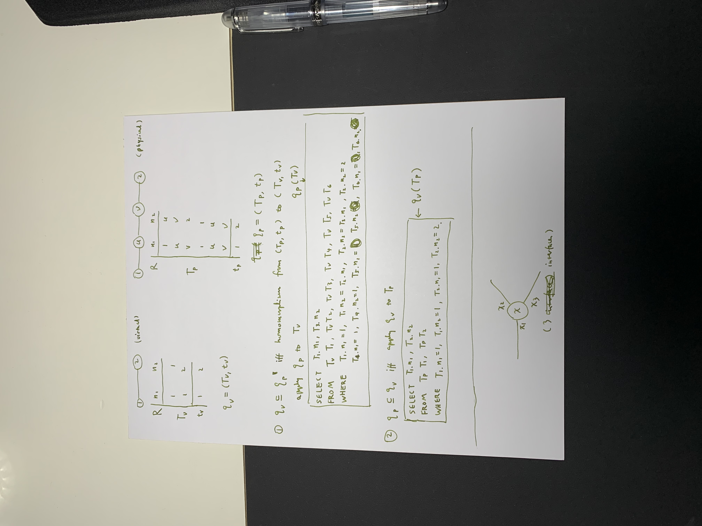

# Results

|query|instance|is tautology|
|---|---|---|
|T_v|T_p|True|
|T_p|T_v|False*|
|T_v'|T_p'|True|
|T_p'|T_v'|True|

*: Data instance is a constant table, so there is no variable and condition. The result table is an empty table.

## Tables
**T_v**
|n1|n2|
|-|-|
|1|2|

**T_p**
|n1|n2|
|-|-|
|1|u|
|u|v|
|v|2|

**T_v'**
|n1|n2|
|-|-|
|1|1|
|1|2|

**T_p'**
|n1|n2|
|-|-|
|1|u|
|u|v|
|v|2|
|1|1|
|u|u|
|v|v|
</td></tr> </table>

