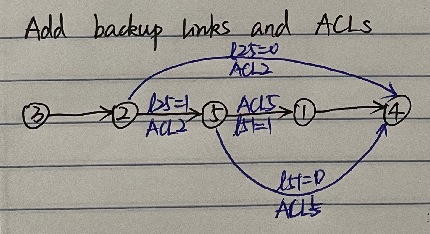

# Generate large tableau from Rocketfuel topology

## Ideas of generating tableau for link failure

1. Choose one of Rocketfuel topology.
2. Find the largest compoenent of the Rocketfuel topology(treat the topology as a undirected graph), use this component as the topology to generate forwarding table. Some of Rocketfuel topologies are not connected. 


3. Calculting Hamiltonian path from this topology. Using the first node of hamiltionian path as source node and the last node as destination node.
4. The links in Hamiltonian path are primary links. 
   


5. Randomly pick n nodes adding a backup link and ACL. The backup link connects the picked node and the node after the picked node(in the order nodes sequence of hamiltonian path).



## Script

```python
file_dir  = '/../../topo/ISP_topo/'
filename = "4755_edges.txt"

as_tablename = 'as_4755'
topo_tablename = "topo_4755"
fwd_tablename = "fwd_4755"

pick_num = 2

gen_tableau_for_link_failures(file_dir, filename, as_tablename, topo_tablename, fwd_tablename, pick_num)

```

`gen_tableau_script.py` is the script for generating tableau.

`func_gen_tableau_link_failure.py` contains the functions used to generate tableau for link failure topology.